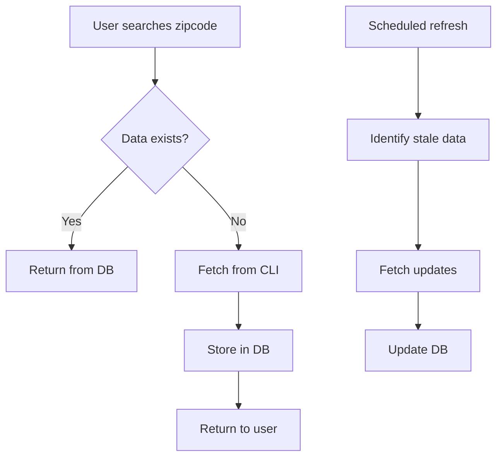

# Database Seeding Guide

This guide explains how to seed the GymIntel database with data for development and production environments.

## Overview

GymIntel supports multiple data seeding strategies:

1. **Development Seeding**: Sample data for local development
2. **JIT (Just-In-Time) Fetching**: Automatic data fetching when users search
3. **CLI Data Import**: Import existing data from CLI exports
4. **Production Refresh**: Scheduled updates for active zipcodes

## Development Seeding

### Quick Start

```bash
# Option 1: Seed on Docker startup
SEED_DATABASE=true docker-compose up

# Option 2: Manual seeding
cd backend
python scripts/seed_db.py
```

### Sample Data Included

- 3 Metropolitan Areas (Austin, San Francisco, New York)
- 4 Sample Gyms with varying confidence scores
- Sample reviews and data sources
- Realistic coordinate data

### Environment Variables

```bash
# Enable automatic database initialization
AUTO_INIT_DB=true

# Enable automatic seeding (development only)
SEED_DATABASE=true
```

## Production Data Strategy

### Just-In-Time (JIT) Data Fetching

When a user searches for a zipcode with no data:

1. GraphQL resolver checks database for existing data
2. If no data exists, it automatically fetches from CLI
3. Results are stored in database for future queries
4. User sees fresh results immediately

**Benefits:**
- No need to pre-seed all zipcodes
- Always serves fresh data on first search
- Reduces initial database size
- Scales efficiently with usage

### Manual Data Import

Import data from CLI exports:

```bash
# Import from CLI JSON export
python scripts/seed_db.py --import-file exports/gyms_78704.json

# Refresh specific zipcode
python scripts/seed_db.py --refresh-zipcode 78704
```

### Scheduled Production Refresh

Keep data fresh with scheduled updates:

```bash
# Refresh top 10 most searched zipcodes
python scripts/refresh_production_data.py --top-zipcodes 10

# Refresh zipcodes not updated in 7 days
python scripts/refresh_production_data.py --stale-days 7

# Refresh specific zipcodes
python scripts/refresh_production_data.py --zipcodes 78704 78705
```

#### Cron Example

```cron
# Refresh top 20 zipcodes daily at 3 AM
0 3 * * * cd /app/backend && python scripts/refresh_production_data.py --top-zipcodes 20

# Weekly refresh of stale data (Sundays at 2 AM)
0 2 * * 0 cd /app/backend && python scripts/refresh_production_data.py --stale-days 14 --max-zipcodes 50
```

## Seeding Scripts

### seed_db.py

Main seeding script with multiple modes:

```bash
# Development seeding (default)
python scripts/seed_db.py

# Production mode
python scripts/seed_db.py --production

# Import from file
python scripts/seed_db.py --import-file data.json

# Refresh zipcode
python scripts/seed_db.py --refresh-zipcode 78704

# Skip confirmations
python scripts/seed_db.py --force
```

### refresh_production_data.py

Production-focused refresh script:

```bash
# Show what would be refreshed (dry run)
python scripts/refresh_production_data.py --top-zipcodes 5 --dry-run

# Limit number of zipcodes
python scripts/refresh_production_data.py --stale-days 7 --max-zipcodes 25
```

## Data Flow



## Best Practices

### Development

1. Use `SEED_DATABASE=true` for initial setup
2. Reset with: `python scripts/init_db.py --force && python scripts/seed_db.py`
3. Test with different confidence scores and data states

### Production

1. **Don't pre-seed everything** - Let JIT handle initial data
2. **Schedule refreshes** for high-traffic zipcodes
3. **Monitor stale data** - Set appropriate refresh intervals
4. **Rate limit API calls** - Respect external API limits

### Data Quality

1. **Confidence scores** - Preserved from CLI calculations
2. **Source tracking** - Multiple data sources tracked
3. **Update timestamps** - Track data freshness
4. **Raw data storage** - Keep original API responses

## Troubleshooting

### Common Issues

**No CLI services available:**
```bash
# Ensure CLI is mounted in Docker
volumes:
  - ../../gymintel-cli/src:/app/cli_services
```

**Import fails with duplicate data:**
- The import process updates existing gyms
- Use unique name + address combination

**Refresh rate limits:**
- Built-in 2-second delay between API calls
- Adjust with `--max-zipcodes` parameter

### Debug Commands

```bash
# Check current data
cd backend
python -c "
from app.database import get_session
from app.models import Gym
import asyncio

async def count():
    async with get_session() as session:
        from sqlalchemy import select, func
        result = await session.execute(select(func.count(Gym.id)))
        print(f'Total gyms: {result.scalar()}')

asyncio.run(count())
"

# Check specific zipcode
python -c "
from app.database import get_session
from app.models import Gym
import asyncio

async def check(zipcode):
    async with get_session() as session:
        from sqlalchemy import select
        result = await session.execute(
            select(Gym).where(Gym.source_zipcode == zipcode)
        )
        gyms = result.scalars().all()
        print(f'Gyms in {zipcode}: {len(gyms)}')

asyncio.run(check('78704'))
"
```

## Security Considerations

1. **API Keys**: Required for data fetching
   - Set `YELP_API_KEY` and `GOOGLE_PLACES_API_KEY`
   - Never commit keys to repository

2. **Rate Limiting**: Prevent API abuse
   - JIT fetching is naturally rate-limited by user searches
   - Scheduled refreshes include delays

3. **Data Privacy**:
   - No personal user data in seeded content
   - Public business information only

## Future Enhancements

1. **Smart Refresh**: ML-based prediction of which zipcodes need updates
2. **Incremental Updates**: Only fetch changed data
3. **Multi-source Sync**: Coordinate updates across data sources
4. **Analytics Integration**: Seed based on actual usage patterns
